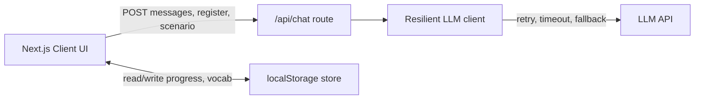

# LingoQuest — Design

Technical design for the LingoQuest MVP described in [REQUIREMENTS.md](REQUIREMENTS.md). A game-like web app where school students practice real-time English conversations with an AI character, choosing a formal or informal register, and earn coins that advance an avatar across a world map.

## 1. Tech Stack
- **Framework:** Next.js (App Router) + TypeScript — one Node.js app serving both UI and API routes.
- **Styling:** Tailwind CSS (playful, Roblox/Minecraft-inspired visuals).
- **Storage:** Browser `localStorage` as the primary store (no database, no accounts in v1).
- **LLM access:** Server-side only, via a Next.js API route that wraps a resilient LLM client. The browser never sees the API key.

## 2. High-Level Architecture

- The client sends conversation messages plus the chosen register (formal/informal) and scenario to `/api/chat`.
- The API route calls the resilient LLM client, which returns a single structured JSON payload: the assistant reply, gentle corrections, and any new vocabulary.
- The UI renders the reply and feedback, auto-saves new words, and updates coins/XP/map progress in `localStorage`.

## 3. Configuration
Environment variables in `.env.local` (provided by the user, documented in the README):

| Variable | Required | Default | Purpose |
| --- | --- | --- | --- |
| `OPENAI_API_KEY` | Yes | - | OpenAI API key (server-side only) |
| `OPENAI_BASE_URL` | No | `https://api.openai.com/v1` | OpenAI-compatible base URL |
| `OPENAI_MODEL` | No | `gpt-5.4-nano` | Model name (latest low-cost GPT nano) |

App constant:
- `COINS_PER_MINUTE` — coins-to-screen-time convention. Default: **100 coins = 15 min** (editable).

## 4. Data Model (localStorage)
Accessed through a typed, SSR-safe store module (`lib/store.ts`).

- **`profile`**: `{ avatarId, coins, xp, level, mapProgress }`
- **`vocabulary`**: `[{ word, meaning, example, addedAt }]`

`mapProgress` is the index of the furthest unlocked region; XP thresholds unlock the next region.

## 5. Resilient LLM Client (`lib/llm.ts`)
Purpose: a single, dependable entry point for all LLM calls so the UI never breaks.

- **Timeout:** `AbortController` cancels slow requests.
- **Retry:** exponential backoff on `429` and `5xx` responses.
- **Fallback:** returns a graceful, in-character message if all attempts fail.
- **Prompting:** builds the system prompt from the selected register (formal vs. informal) and the active scenario, and constrains tone/topic to be school-appropriate.
- **Structured output:** requests JSON of the form `{ reply, corrections[], newWords[] }`.

## 6. Screens & Routes
| Route | Screen | Responsibility |
| --- | --- | --- |
| `/` | Home / Map | World-map avatar journey, coin balance, avatar, scenario picker |
| `/chat` | Conversation | Chat UI, formal/informal toggle, live feedback panel, coin/XP reward on completion |
| `/vocabulary` | Vocabulary | Saved words with meaning and example |
| `/shop` | Rewards / Shop | Spend coins on avatars/characters and redeem screen-time |

Supporting components: `ChatWindow`, `RegisterToggle`, `FeedbackPanel`, `WorldMap`, `CoinBadge`, `AvatarPicker`.

## 7. Gamification Model
- Coins and XP are awarded per completed conversation.
- XP drives level, and levels unlock new map regions (avatar travels toward the country where the language is spoken).
- Coins are spent in the shop on unlockable avatars/animated characters and converted to screen-time via `COINS_PER_MINUTE`.

## 8. Design Decisions (resolved open questions)
- **Coins → time:** fixed convention (100 coins = 15 min), exposed as an editable constant.
- **Provider:** OpenAI-compatible endpoint configured via env, so providers can be swapped without code changes.
- **Kid-safety:** enforced in v1 through the system prompt (school-appropriate topic/tone); real content moderation is a noted follow-up.

## 9. Out of Scope (v1)
Accounts, teacher/class dashboards, multiplayer, voice/speech, native mobile app, and real (enforced) screen-time control.
